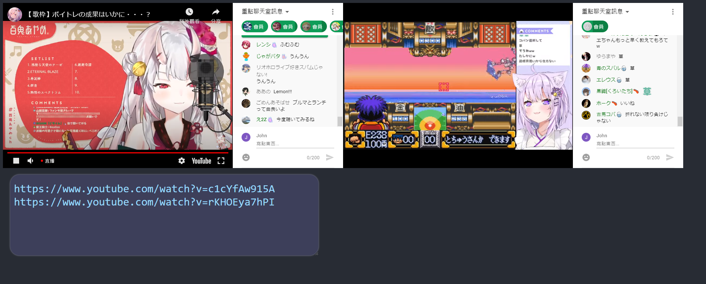

# Multiple-Embedded-Youtube-Player
Playing multiple YouTube videos at the same time. Watching multiple livestreams with live chat support.
Page Layout 

## LINK: 
<a href="https://kkchengaf.github.io/Multiple-Embedded-Youtube-Player/" alt="link to video player website">Multiple Embedded Youtube Player</a>

## HOW TO USE:
Paste a valid youtube link in the text box to load a video 

## TIPS:
### Loading Video
To load multiple videos correctly, put each link in a separate line 
DO NOT TYPE the url YOURSELVES, it will trigger the hotkey and will affect the playing videos 
The text box will check and filter repeat urls, DO NOT TRY to repeat same youtube link  
DO NOT PLACE TOO MANY URLS AND PLAY ALL VIDEOS AT THE SAME TIME 
### Playing Video
Presss "P" to play all the videos, "M" to mute all videos 
You can toggle all livechat by pressing "C"
### Syncing Livestream Replay
Jump to the time in the progress bar in 1 video, then Presss "R" to sync all livestream replay 
This may include delay.

### Layout
You can switch between dark theme and light theme by pressing "D" 
You can switch the live chat dark theme by pressing "N" 
You can adjust the width and height of a video player using the sliders under the video, which can be toggled by pressing "S" 
By default, the aspect ratio of the video player is locked (16:9), you can unlock/lock by pressing "L" 
You can adjust the size of text box, or hide the text box by pressing "H" 
You can adjust the size of all video players to be the same by pressing "K" 

## HOTKEYS: 
P/SPACE - play/pause all videos 
M - mute/unmute all videos 
H - hide/show the text box 
S - hide/show the size adjusting sliders 
D - toggle dark theme/normal theme 
L - lock aspect ratio to 16:9 when resizing 
K - set all videos size to the one previously set 
R - Sync all the live stream replay time based on the last video jumped time  
C - toggle livechat 
N - toggle livechat dark theme 
T - toggle side menu 
When the hotkey is not working, it is probably because your cursor is focusing on the videos.  
Please click outside the videos to leave the focus and retry again.  
